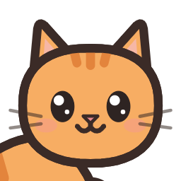
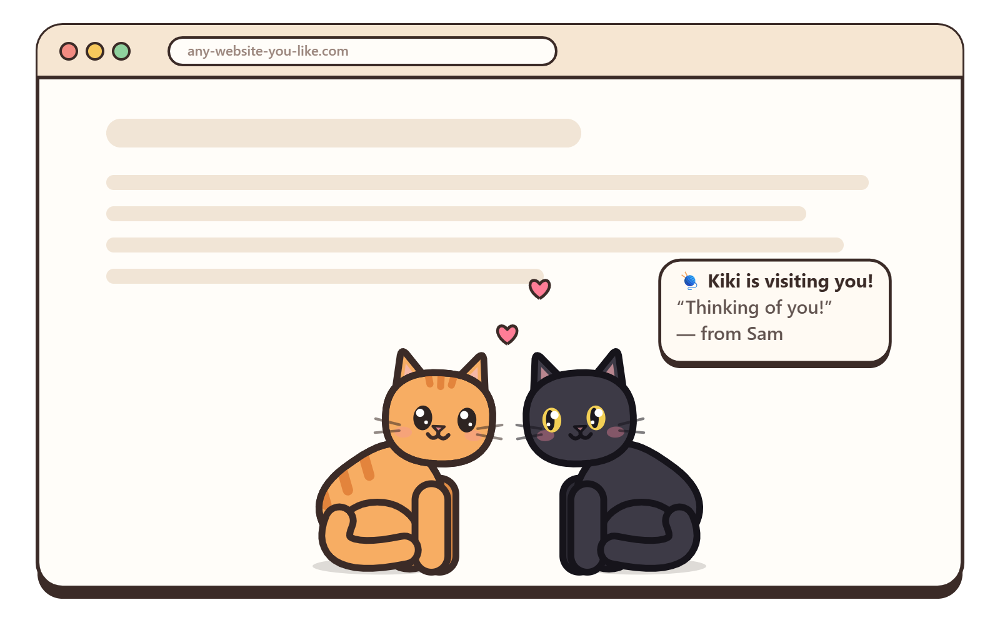
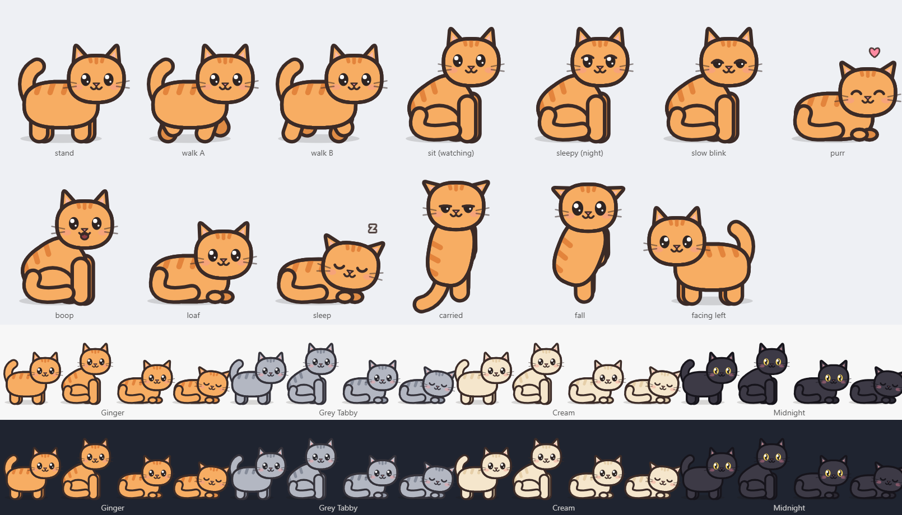

<p align="center">
  
</p>

<h1 align="center">Kitty Next Door</h1>

<p align="center">
  <b>A little cat that lives on your screen, keeps you company, and walks over to visit your friends.</b><br />
  A cute desktop pet and browser pet for <b>Chrome</b>, <b>Microsoft Edge</b>, <b>Firefox</b> and <b>Windows</b>.
</p>

<p align="center">
  <a href="https://kitty-next-door.kittynextdoor.workers.dev"></a>
  <a href="https://github.com/fahmid-juboraj/kitty-next-door/releases/latest"></a>
  <a href="https://github.com/fahmid-juboraj/kitty-next-door/releases"></a>
  <a href="LICENSE"></a>
  <a href="https://github.com/fahmid-juboraj/kitty-next-door/stargazers"></a>
</p>

<p align="center">
  <a href="#install-on-chrome"></a>
  <a href="#install-on-microsoft-edge"></a>
  <a href="#install-on-firefox"></a>
  <a href="#install-the-windows-app"></a>
</p>

<p align="center">
  <a href="https://kitty-next-door.kittynextdoor.workers.dev">Website</a> ·
  <a href="#install">Install</a> ·
  <a href="#friend-visits">Friend visits</a> ·
  <a href="#uninstall">Uninstall</a> ·
  <a href="#faq">FAQ</a> ·
  <a href="#for-developers">Developers</a>
</p>

<p align="center">
  
</p>

## What it does

Kitty Next Door is a **virtual cat companion** for people who spend long days at the computer. It isn't a game you have to keep feeding. It just keeps you company.

- 🐾 **Lives on your screen.** It walks, sits, loafs and naps along the bottom of your screen or every web page. Clicks pass straight through it, so it never gets in your way.
- 👀 **Notices you.** Its eyes follow your cursor, and it slow-blinks at you, which is how cats say "I trust you". Step away and it curls up to sleep; come back and it wakes up to greet you.
- 💕 **Loves attention.** Rub your mouse over it to pet it and it purrs and shows hearts. Click it for a little "mrrp". Pick it up by the scruff and it looks deeply unimpressed.
- 💌 **Visits your friends, in real time.** Send your cat with a note, a gift and even a **letter**. It walks off your screen and onto theirs, sits with their cat, then comes home.
- 🌳 **The Kitty Park.** Send your cat to a live [public park](https://kitty-next-door.kittynextdoor.workers.dev/park/) where cats from everywhere play together. One wears the 👑 as Cat of the Hour, and you can make a 📸 postcard to share.
- 🎨 **Four coats:** Ginger, Grey Tabby, Cream and Midnight.
- 🔒 **Private by design.** It never reads the pages you visit or what you type.

<p align="center"></p>

## Install

Store listings are on the way. Until then, everything installs from the [latest release](https://github.com/fahmid-juboraj/kitty-next-door/releases/latest). Use **one** extension per browser. **Kitty Next Door Live** (real-time visits) is the one to get.

### Install on Chrome
1. Download `kitty-next-door-live-chrome-<version>.zip` from the [latest release](https://github.com/fahmid-juboraj/kitty-next-door/releases/latest) and unzip it.
2. Open `chrome://extensions` and turn on **Developer mode** (top right).
3. Click **Load unpacked** and choose the unzipped folder.
4. Click the puzzle-piece icon in the toolbar and pin **Kitty Next Door Live**. Your friend code is in its popup.

### Install on Microsoft Edge
1. Download `kitty-next-door-live-edge-<version>.zip` from the [latest release](https://github.com/fahmid-juboraj/kitty-next-door/releases/latest) and unzip it.
2. Open `edge://extensions` and turn on **Developer mode** (left side).
3. Click **Load unpacked** and choose the unzipped folder.

### Install on Firefox
1. Download `kitty-next-door-live-firefox-<version>.zip` from the [latest release](https://github.com/fahmid-juboraj/kitty-next-door/releases/latest).
2. Open `about:debugging#/runtime/this-firefox`, click **Load Temporary Add-on** and choose the zip. Firefox 140 or newer is needed.
3. Temporary add-ons are removed when Firefox restarts. The permanent version arrives with the Firefox Add-ons listing.

### Install the Windows app
1. Download **`Kitty-Next-Door-Setup-<version>.exe`** from the [latest release](https://github.com/fahmid-juboraj/kitty-next-door/releases/latest). If you don't want to install anything, get `Kitty-Next-Door-Portable-<version>.exe` instead.
2. The app isn't code-signed yet, so Windows shows **"Windows protected your PC"**. Click **More info → Run anyway**.
3. Your cat appears at the bottom of your screen. Right-click the 🐱 tray icon (near the clock) to **hide** it, turn on **Start with Windows**, or **quit**.

The Windows app works on Windows 10 and 11 (64-bit). The browser extensions should also work in Chrome, Edge and Firefox on macOS and Linux, though they've been tested on Windows.

## Friend visits

1. Open the extension's popup and copy **your friend code**. It looks like `7K2F-9QXM`.
2. Send it to a friend. They type it into **Add a friend by code**, and you accept the request.
3. Next to their name, add a note, pick a gift (🐟 🧶 🌸 🐭), optionally write or paste a **letter**, and press **Send**.
4. Your cat walks off your screen and appears on theirs a moment later, even if they're on the other side of the world. If they're offline, it waits at their door and walks in when they're back.
5. It comes home by itself after a couple of hours. You can also press **Call home**, or they can press **Send home**.
6. A cat carrying a letter shows a ✉️. Your friend clicks the cat (or opens the popup) to read it and copy it. The letter is deleted when the cat goes home.

## Kitty Park

Open the popup and click **🌳 Send to the Park**. Your cat walks off your screen and into the [Kitty Park](https://kitty-next-door.kittynextdoor.workers.dev/park/), where everyone watching can see it play with cats from all over the world. Cats say hello, have zoomies and nap together on the bench at night.
- One cat wears the 👑 as **Cat of the Hour**, and its owner gets a notification.
- Click a cat and press **📸 Postcard** for a shareable picture.
- Only your cat's name and coat are shown in the park, never your name or friend code. Your cat comes home after an hour, or whenever you press **Call home**.

## Uninstall

**Windows app (installer):** open **Settings → Apps → Installed apps**, find **Kitty Next Door**, click **⋯ → Uninstall**. On Windows 10 it's **Settings → Apps & features**, or **Control Panel → Programs and Features**. This removes the app, its shortcuts, its settings and the "Start with Windows" entry.

**Windows app (portable):**
1. Right-click the tray icon and turn off **Start with Windows**.
2. Click **Quit**.
3. Delete the `.exe`.

**Chrome / Edge:** right-click the cat icon in the toolbar and choose **Remove from Chrome** (or **Remove from Microsoft Edge**). You can also remove it from `chrome://extensions` or `edge://extensions`.

**Firefox:** open `about:addons`, click **⋯** next to Kitty Next Door and choose **Remove**.

**Your friend code and friends list:** before removing the Live extension, open its popup and choose **Settings → Delete my account**. That erases your record from the server and sends any visiting cats home.

## Privacy

- **The Windows app and the link-based extension** never send anything anywhere.
- **Kitty Next Door Live** sends only what visits need: your cat's name and coat, the name you choose to show friends, your friends list and your visit notes. It never reads the pages you visit, what you type or your browsing history.

Full details are in [PRIVACY.md](realtime/PRIVACY.md). The website uses Cloudflare Web Analytics, which is cookieless and counts page views without tracking anyone.

## FAQ

**Is it free?** Yes. There are no ads, no accounts to buy and no tracking.

**Why does Windows warn me about the installer?** The app isn't code-signed yet, and signing certificates cost money. The full source code is here, so you (or anyone) can check what it does, or build it yourself.

**Will it slow my computer down?**
- **Browser extensions:** tiny, about 45 KB, and they pause in background tabs.
- **Windows app:** built on Electron and uses about 300 MB of RAM. A lighter version is on the roadmap.

**Does the cat show up when I share my screen?**
- **Windows app:** yes, it stays on top of everything. Right-click the tray icon and choose **Hide cat** before presenting.
- **Extension:** turn on **Hide on this site** in its popup for any site you don't want it on.

**Can I use it at work or school?** Yes. It's quiet, never makes a sound, and naps most of the time.

**Is it like Shimeji, Desktop Goose or Bongo Cat?** It's in the same family of desktop pets, with a focus on calm companionship, and it's the only one we know of where your cat can actually go and visit a friend.

## For developers

```sh
npm install
npm start                 # Windows desktop app (Electron)
npm start -- --demo       # short timers, handy for recording videos
npm run build:ext         # link-based extensions + the website into dist-ext/ and dist-site/
npm run dist:win          # Windows installer + portable exe into release/
npm test                  # unit tests
```

The real-time version (server and extensions) lives in [`realtime/`](realtime/README.md). It has its own build, tests and deployment notes.

```
src/core/      The cat itself: behavior (brain.ts), pose rig, drawing, coats, visit links
src/main/      Windows app shell (Electron): transparent overlay, tray, click-through
src/ext/       Link-based browser extension
src/site/      Website: home page and visit page
realtime/      Kitty Next Door Live: Cloudflare Worker + Durable Objects server, extensions, tests
```

Everything you see is drawn in code, with no image files for the cat. That keeps it tiny and lets its eyes, breathing and coat colors animate freely.

## Roadmap

- [x] Windows desktop app: overlay, petting, pick-up, slow blink, greeting when you come back
- [x] Browser extensions for Chrome, Edge and Firefox
- [x] Real-time friend visits
- [x] Letters carried by visiting cats
- [x] The Kitty Park: a live public park, Cat of the Hour, postcards
- [ ] Chrome Web Store, Firefox Add-ons and Edge Add-ons listings
- [ ] Hide automatically during fullscreen apps, meetings and presentations
- [ ] "Sam is petting your cat 💕" notifications and online status for friends
- [ ] More life: grooming, stretching, chasing the cursor
- [ ] A lighter Windows app, plus macOS and Linux desktop versions

## License

Kitty Next Door is **source-available** under the [PolyForm Noncommercial License 1.0.0](LICENSE). You're free to use, study, modify and share it for any noncommercial purpose, as long as you keep the credit line at the top of the LICENSE. For commercial use, please ask first by opening an issue.

Made with care by [Fahmid](https://github.com/fahmid-juboraj).

<sub>Keywords: desktop pet, virtual pet, browser pet, desktop cat, cute cat, cat companion, desktop companion, virtual companion, Chrome extension, Firefox add-on, Microsoft Edge extension, Windows desktop app, Shimeji alternative, cozy app, focus buddy, pet that visits friends.</sub>
